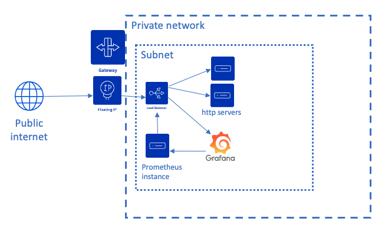
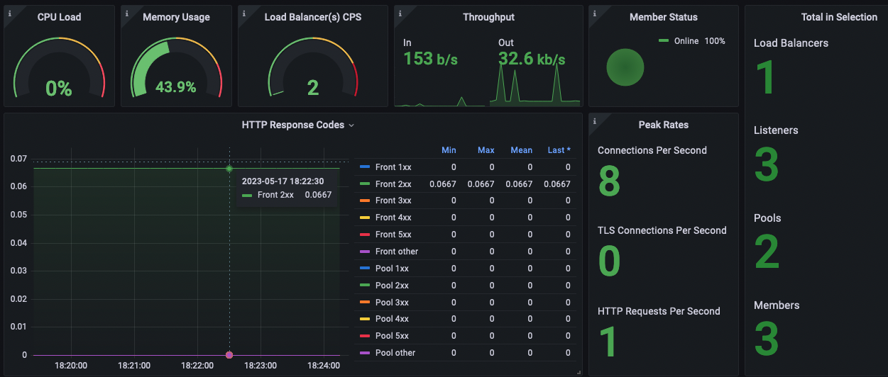

# Objectives

The objectives of this example are to show:
* how to use terraform with [Public Cloud Load Balancer](https://www.ovhcloud.com/en/public-cloud/load-balancer/)
* how to set up the [Load Balancer built in Prometheus listener](https://docs.openstack.org/octavia/latest/user/guides/monitoring.html#monitoring-with-prometheus)  to monitor it
* how to connect this listener to a prometheus and to a [Grafana managed instance](https://www.ovhcloud.com/en/public-cloud/grafana/)

# Description 

This example creates:
- an openstack user that will be used to create the whole infrastructure
- a private network
- a Public Gateway and a floating IP that will be used to receive the incoming traffic on the load balancer
- an HTTP load balancer with 3 listeners : 443 for the HTTPS load balanced traffic, 8088 for the prometheus metrics (this listener is protected to be accessible only from the private network), 80443 to expose the Grafana UI on the internet (because the instance is deployed in the private network)
- 2 HTTP servers (the number of HTTP server can changed using the `instance_nb` variable) 
- an instance that will run prometheus to scrape the metrics from the load balancer and to make them available on Grafana 
- a Grafana managed instance on which the opensource [dashboard](https://grafana.com/grafana/dashboards/15828-octavia-amphora-load-balancer/) is deployed. 
- a certificate that is retrieved from Let's Encrypt service. 

The architecture is the following:

 

# Inputs / prerequisites

You will need to have `terraform` binary in your `PATH`. Installation doc is available on [Hashicorp website](https://developer.hashicorp.com/terraform/downloads)
This script requires the following variables to be defined for the OVH provider :
- OVH_ENDPOINT
- OVH_APPLICATION_KEY
- OVH_APPLICATION_SECRET
- OVH_CONSUMER_KEY

Look at the [ovh provider documentation](https://registry.terraform.io/providers/ovh/ovh/latest/docs) to generate the values for those variables.

Additionaly the variables are needed or will be requested on script startup :
-  `TF_VAR_ovh_public_cloud_project_id` your public cloud project id. You can find in this [documentation page](https://help.ovhcloud.com/csm/en-gb-public-cloud-compute-create-project?id=kb_article_view&sysparm_article=KB0050592) how to create your first public cloud project.
-  `TF_VAR_dns_zone` the OVH DNS zone where the load balancer record will be created with the created floating ip
-  `TF_VAR_acme_email_address` the email adress used for the Let's Encrypt registration

# Limitations

- When interacting with Grafana, HTTPS is used with a self signed certificate which means that will receive a security message from your browser. 
- The secrets that are managed by this script are stored in the state [backend](https://developer.hashicorp.com/terraform/language/settings/backends/configuration) (by default a local file). If you use this example in production, be sure to consider the state backend as tool that manages secrets.

# Outputs

Run `terraform init` and `terraform apply` to launch the infrastructure provisionning.
The outputs are :
- the URL to be used for the HTTP load balancer : if you reload the page, you should see that the member that is handling the request has changed (courtesy of the round robin algorithm).
- the URL for the Grafana service. 
- the user to login to the Grafana service.
- the password to login to the Grafana service. Since it is sensitive, to see it, you need to run `terraform output -raw grafana_password`

# Looking at your load balancer metrics
- Connect to the Grafana URL provided as output, accept the self signed certificate, log in using the user / password provided as output
- Now you are in Grafana dashboard page, choose the `OpenStack Octavia Amphora Load Balancer`  and you should see something like 

- If you want to see the metrics figures increase, you can use a stress tool like [wrk](https://github.com/wg/wrk)

# Costs
At the time of this writing (May 2023), the hourly [prices](https://www.ovhcloud.com/en-ie/public-cloud/prices/) are  :
- 1 small gateway (€0.0028)
- 1 floating IP (€0.0025)
- 1 small load balancer (€0.0083)
- 3 d2-2 instances (3*€0.0099)
- 1 Grafana (€0.0591)

So running this example for one hour will cost you around € 0.10 !

